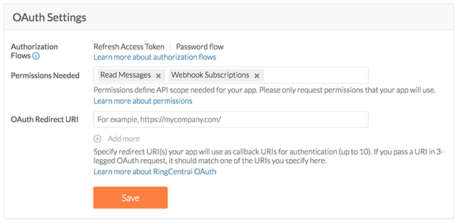

# RingCentral Permahooks

[![Build Status][build-status-svg]][build-status-link]
[![Go Report Card][goreport-svg]][goreport-link]
[![Docs][docs-godoc-svg]][docs-godoc-link]
[![License][license-svg]][license-link]

This is a small app that turns RingCentral's expiring outbound webhooks into non-expiring webhooks. This is especially useful when connecting to a service with a simple inbound webhook implementation such as Zapier and chat solutions like [Glip](https://glip.com). Benefits include:

* Seamlessly links RingCentral Outbound Webhooks with Inbound Webhooks offered by Zapier, Glip and others.
* Automatically handles `Validation-Token`
* Automatically handles RingCentral webhook renewal

This is useful because RingCentral's webhook implementation has a couple of features that are not supported by all webhook consuming services:

* RingCentral requires the webhook endpoint return the request `Validation-Token` header in the response to indicate the receiving endpoint is the correct one.
* RingCentral webhooks expire to ensure the correct site is receiving the information.

However, some sites can only receive a simple webhook post without these features, this service converts RingCentral's webhooks into a simple webhook for these services.

Deployment options:

* Run locally: only the `server.go` file is necessary as shown below.
* Heroku: currently in progress including `Procfile` and `Godeps` folder.
* Lambda: TBD, but will likely use [eawsy/aws-lambda-go-shim](https://github.com/eawsy/aws-lambda-go-shim) like [Chathooks](https://github.com/grokify/chathooks)

See more information about creating RingCentral webhooks here:

* API Reference: https://developer.ringcentral.com/api-docs/latest/index.html#!#RefCreateSubscription
* Developer Guide: http://ringcentral-api-docs.readthedocs.io/en/latest/webhooks/

## Pre-requisites

You must have created an app on the RingCentral Developer Platform by logging into the Developer Portal:

https://developer.ringcentral.com

The app must have the following settings:

* OAuth Grant Types: `Password flow`
* Permissions: `Read Messages`, `Webhook Subscriptions`

In the Developer Portal, your app will (minimally) look like this:



## Installation and Configuration

Before you can complete the following installation procedure, you need to get a webhook URL from your downstream service. For example, a Zapier webhook URL.

```bash
$ go get github.com/grokify/ringcentral-permahooks
$ cd $GOPATH/src/github.com/grokify/ringcentral-permahooks
$ cp sample.env .env
$ vi .env
$ go run server.go
```

After you start the service, create a webhook by calling the `/createhook` endpoint. You can also call the `/renewhook` endpoint to manually renew the webhook. For example:

```bash
# Create Webhook
$ curl -XGET 'https://12345678.ngrok.io/createhook'

# Renew Webhook
$ curl -XGET 'https://12345678.ngrok.io/renewhook'
```

Successfully calling `/createhook` will result in log entries like the following:

```bash
$ go run server.go 
INFO[0023] Creating Hook...                             
INFO[0024] {"eventFilters":["/restapi/v1.0/account/~/extension/~/message-store/instant?type=SMS","/restapi/v1.0/subscription/~?threshold=86400\u0026interval=3600"],"deliveryMode":{"transportType":"WebHook","address":"https://12345678.ngrok.io/webhook"},"expiresIn":604800} 
INFO[0025] Handling webhook...                          
INFO[0025] Validation-Token: 11112222-3333-4444-5555-666677778888 
INFO[0025] Created/renewed Webhook with Id: 11112222-3333-4444-5555-666677778888
```

### Tunneling

If your server is behind a NAT or a firewall and not accessible via the Internet, you can use a tunneling service such as [ngrok](https://ngrok.com/). In the following example, you would create a RingCentral webhook to `https://12345678.ngrok.io/webhook` which you would set as `PERMAHOOKS_INBOUND_WEBHOOK_URL` in your environment.

```bash
$ ngrok http 8080

ngrok by @inconshreveable                                                                             (Ctrl+C to quit)
                                                                                                                      
Tunnel Status                 online                                         
Update                        update available (version 2.2.8, Ctrl-U to update)
Version                       2.0.25/prod                              
Region                        United States (us)                            
Web Interface                 http://127.0.0.1:4040                            
Forwarding                    http://12345678.ngrok.io -> localhost:8080       
Forwarding                    https://12345678.ngrok.io -> localhost:8080

Connections                   ttl     opn     rt1     rt5     p50     p90
                              83      0       0.00    0.00    18.68   301.08
```

## To Do

### Heroku deployment

To support Heroku, dependences are managed with `godep`. The following is used:

```bash
$ go get -u github.com/tools/godep
$ cd $GOPATH/src/github.com/grokify/ringcentral-permahooks
$ godep save ./...
```

More information is avialable here:

https://devcenter.heroku.com/articles/go-dependencies-via-godep

## Support

If you have questions or support, please use the following resources:

* Stack Overflow: https://stackoverflow.com/questions/tagged/ringcentral
* GitHub: https://github.com/grokify/ringcentral-permahooks/issues

 [build-status-svg]: https://api.travis-ci.org/grokify/ringcentral-permahooks.svg?branch=master
 [build-status-link]: https://travis-ci.org/grokify/ringcentral-permahooks
 [goreport-svg]: https://goreportcard.com/badge/github.com/grokify/ringcentral-permahooks
 [goreport-link]: https://goreportcard.com/report/github.com/grokify/ringcentral-permahooks
 [docs-godoc-svg]: https://img.shields.io/badge/docs-godoc-blue.svg
 [docs-godoc-link]: https://godoc.org/github.com/grokify/ringcentral-permahooks
 [license-svg]: https://img.shields.io/badge/license-MIT-blue.svg
 [license-link]: https://github.com/grokify/ringcentral-permahooks/blob/master/LICENSE.md
